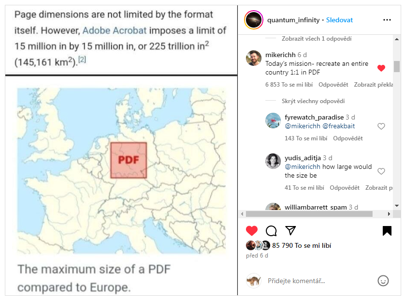

# project Borges

create map in 1:1 scale

> Today's mission - recreate an entire country in PDF
>
> -- user @mikerichh

## idea

There is [a short story](https://en.wikipedia.org/wiki/On_Exactitude_in_Science) by Jorge Luis Borges about an empire where cartography becames so exact the have map in 1:1 scale. 

As [it's possible to create PDF almost 381km wide](https://alexwlchan.net/2024/big-pdf/), it should be possible to fit some small country into PDF in 1:1 size thus making Borges idea reality.

As I have worked on [some openstreetmap renderers](https://github.com/severak/lunarender3?tab=readme-ov-file#my-previous-work) this should be definitely possible. Not yet implemented though.
 
